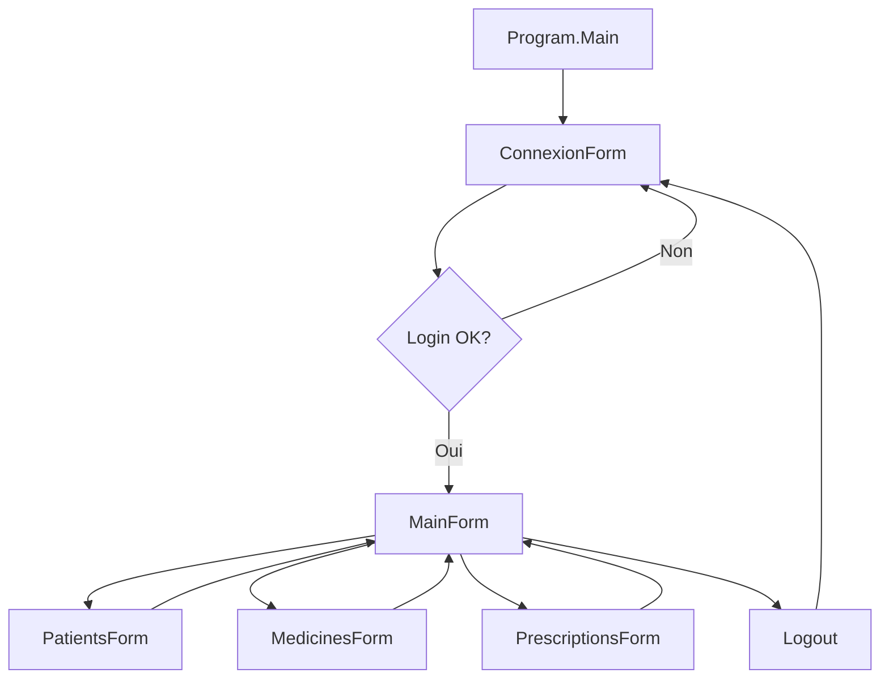

# ?? Documentation Technique - Application GSB2

## ?? Table des matières
1. [Architecture du Projet](#architecture-du-projet)
2. [Structure des Fichiers](#structure-des-fichiers)
3. [Modèles de Données](#modèles-de-données)
4. [Couche DAO (Data Access Object)](#couche-dao)
5. [Formulaires et Interfaces](#formulaires-et-interfaces)
6. [Utilitaires](#utilitaires)
7. [Base de Données](#base-de-données)
8. [Sécurité](#sécurité)
9. [Guide de Développement](#guide-de-développement)

---

## ??? Architecture du Projet

### Type de Projet
- **Framework** : .NET 8
- **Langage** : C# 12.0
- **Type d'application** : Windows Forms (WinForms)
- **Base de données** : MySQL
- **Bibliothèques externes** : 
  - `MySql.Data` pour la connexion MySQL
  - `iText` (version 9) pour la génération de PDF

### Pattern Architectural
L'application suit une architecture en **3 couches** :

```
???????????????????????????????????????
?   PRESENTATION (Forms)     ?
?   ConnexionForm, MainForm, etc.     ?
???????????????????????????????????????
  ?
???????????????????????????????????????
?   BUSINESS LOGIC (DAO)         ?
?   UserDAO, PatientDAO, etc.      ?
???????????????????????????????????????
        ?
???????????????????????????????????????
?   DATA (Models + Database)          ?
?   Users, Patients, Medicine, etc.   ?
???????????????????????????????????????
```

### Flux d'Exécution



---

## ?? Structure des Fichiers

### Organisation du Projet

```
GSB2/
?
??? Forms/              # Interfaces utilisateur
?   ??? ConnexionForm.cs           # Formulaire de connexion
?   ??? RegisterForm.cs        # Formulaire d'inscription
?   ??? MainForm.cs      # Menu principal + gestion utilisateurs
?   ??? PatientsForm.cs         # Gestion des patients
?   ??? MedicinesForm.cs      # Gestion des médicaments
?   ??? PrescriptionsForm.cs    # Gestion des prescriptions
?
??? DAO/     # Couche d'accès aux données
?   ??? Database.cs                # Connexion à la base de données
?   ??? UserDAO.cs        # CRUD utilisateurs
?   ??? PatientDAO.cs       # CRUD patients
?   ??? MedicineDAO.cs       # CRUD médicaments
?   ??? PrescriptionDAO.cs         # CRUD prescriptions
?   ??? LiaiMPDAO.cs     # Table de liaison Médicament-Prescription
?
??? Models/               # Modèles de données (POCO)
?   ??? Users.cs  # Modèle utilisateur
?   ??? Patients.cs      # Modèle patient
?   ??? Medicine.cs           # Modèle médicament
?   ??? Prescription.cs   # Modèle prescription
?   ??? LiaiMP.cs       # Modèle liaison (N:N)
?
??? Utils/          # Utilitaires
? ??? PdfExporter.cs           # Export PDF des prescriptions
?
??? Program.cs              # Point d'entrée de l'application
```

---

## ??? Modèles de Données

### 1. `Users.cs` - Modèle Utilisateur

```csharp
public class Users
{
    public int Id_Users { get; set; }   // Identifiant unique
    public string Firstname { get; set; }     // Prénom
    public string Name { get; set; }          // Nom
    public string Email { get; set; }         // Email (unique)
    public string Password { get; set; } // Mot de passe (hashé)
    public bool Role { get; set; }      // True = Admin, False = Médecin
    
    // SB: Constructeur principal utilisé par l'application
    public Users(int id_Users, string firstname, string name, string email, bool role)
}
```

**Utilisation** :
- Représente un utilisateur (médecin ou administrateur)
- Le mot de passe n'est **jamais** récupéré depuis la base (colonne masquée)
- Le constructeur sans mot de passe est utilisé pour les retours de requêtes

### 2. `Patients.cs` - Modèle Patient

```csharp
public class Patients
{
    public int Id_Patients { get; set; }      // Identifiant unique
    public int Id_Users { get; set; }         // Référence vers le médecin créateur
    public string Name { get; set; }  // Nom
    public string Firstname { get; set; }     // Prénom
    public int Age { get; set; }              // Âge
    public string Gender { get; set; }        // Genre (Homme/Femme)
}
```

**Relations** :
- `Id_Users` ? Foreign Key vers `Users.Id_Users`
- Chaque patient est lié à un médecin (créateur)

### 3. `Medicine.cs` - Modèle Médicament

```csharp
public class Medicine
{
    public int Id_Medicine { get; set; }      // Identifiant unique
    public int Id_Users { get; set; }         // Référence vers le créateur
    public string Dosage { get; set; }        // Dosage (ex: 500mg)
    public string Names { get; set; } // Nom commercial
    public string Description { get; set; }   // Description
    public string Molecule { get; set; }      // Principe actif
    
    // SB: Constructeur vide pour l'initialisation
    public Medicine() { }
    
    // SB: Constructeur avec tous les paramètres
    public Medicine(int id_medicine, int id_users, string dosage, 
       string names, string description, string molecule)
}
```

**Relations** :
- `Id_Users` ? Foreign Key vers `Users.Id_Users`

### 4. `Prescription.cs` - Modèle Prescription

```csharp
public class Prescription
{
    public int Id { get; set; }     // Identifiant unique
    public int Id_users { get; set; }// Référence vers le médecin
  public int Id_patients { get; set; }      // Référence vers le patient
    public string Validity { get; set; } // Date de validité (format: yyyy-MM-dd)
}
```

**Relations** :
- `Id_users` ? Foreign Key vers `Users.Id_Users`
- `Id_patients` ? Foreign Key vers `Patients.Id_Patients`
- Relation N:N avec `Medicine` via `LiaiMP`

### 5. `LiaiMP.cs` - Table de Liaison Médicament-Prescription

```csharp
public class LiaiMP
{
    public int Id_medicine { get; set; }      // Référence vers le médicament
    public int Id_prescription { get; set; }  // Référence vers la prescription
    public int Quantity { get; set; }         // Quantité prescrite
}
```

**Utilisation** :
- Permet de lier plusieurs médicaments à une prescription
- Stocke la quantité pour chaque médicament prescrit
- Relation Many-to-Many entre `Medicine` et `Prescription`

---

## ?? Couche DAO (Data Access Object)

### 1. `Database.cs` - Gestion de la Connexion

```csharp
public class Database
{
    private string connectionString = 
"Server=localhost;Database=gsb;Uid=root;Pwd=;";
    
    public MySqlConnection GetConnection()
    {
   return new MySqlConnection(connectionString);
    }
}
```

**Utilisation** :
- Fournit une instance de connexion MySQL
- Utilisé par tous les DAO
- Configuration centralisée de la connexion

**Note** : Modifier `connectionString` selon votre environnement.

### 2. `UserDAO.cs` - Gestion des Utilisateurs

#### Méthodes principales :

##### `GetUsers(string email, string password)` - Authentification
```csharp
// SB: Authentifie un utilisateur et retourne ses informations
public Users GetUsers(string email, string password)
{
    // Requête SQL avec hachage SHA-256 du mot de passe
    string query = @"SELECT id_users, firstname, name, email, role 
            FROM users 
        WHERE email = @email AND password = SHA2(@password, 256);";
    
// Retourne un objet Users ou null si échec
}
```

**Sécurité** :
- Le mot de passe est hashé avec SHA-256 côté SQL
- Ne récupère jamais le mot de passe hashé de la base

##### `Register(string email, string password, string name, string firstname)` - Inscription
```csharp
// SB: Crée un nouveau compte utilisateur avec le rôle "Médecin" par défaut
public bool Register(...)
{
    // 1. Vérifier si l'email existe déjà
    // 2. Insérer avec mot de passe hashé et role = false
    // 3. Retourner true si succès
}
```

##### `CreateUser(...)` - Création Admin
```csharp
// SB: Permet à un admin de créer un utilisateur avec un rôle spécifique
public bool CreateUser(string email, string password, string name, 
   string firstname, bool role)
```

##### `UpdateUser(Users user)` - Mise à jour
```csharp
// SB: Met à jour les informations d'un utilisateur (sauf le mot de passe)
public bool UpdateUser(Users user)
{
    string query = @"UPDATE users
            SET name = @Name, firstname = @Firstname, 
          email = @Email, role = @Role
          WHERE id_users = @Id;";
}
```

**Note** : La mise à jour du mot de passe pourrait être ajoutée séparément.

##### `DeleteUser(int userId)` - Suppression
```csharp
// SB: Supprime un utilisateur de la base de données
public bool DeleteUser(int userId)
```

##### `GetAllUsers()` - Liste complète
```csharp
// SB: Récupère tous les utilisateurs pour affichage dans le DataGridView
public List<Users> GetAllUsers()
```

### 3. `PatientDAO.cs` - Gestion des Patients

#### Méthodes principales :

##### `GetAllPatients()` - Liste avec jointure
```csharp
// SB: Récupère tous les patients avec le nom du médecin référent
public List<dynamic> GetAllPatients()
{
    string query = @"
        SELECT 
            p.id_patients,
    p.id_users,
            p.name,
            p.firstname,
         p.age,
    p.gender,
            u.firstname AS user_firstname,
         u.name AS user_name
        FROM Patients p
        INNER JOIN users u ON p.id_users = u.id_users;";
    
    // Retourne un objet anonyme avec la propriété "Doctor"
    return new {
 Id = ...,
        Name = ...,
Firstname = ...,
        Age = ...,
        Gender = ...,
   Doctor = $"{user_firstname} {user_name}"
    };
}
```

##### `Insert(Patients patient)` - Création
```csharp
// SB: Insère un nouveau patient dans la base de données
public bool Insert(Patients patient)
{
    string query = @"INSERT INTO Patients 
           (id_users, name, firstname, age, gender)
       VALUES (@id_users, @name, @firstname, @age, @gender);";
}
```

##### `DeletePatient(int id)` - Suppression
```csharp
// SB: Supprime un patient de la base de données
public bool DeletePatient(int id)
```

##### `GetPatientsForComboBox()` - Pour les listes déroulantes
```csharp
// SB: Récupère uniquement les champs nécessaires pour les ComboBox
public List<Patients> GetPatientsForComboBox()
{
    // Retourne Id_Patients, Name, Firstname
}
```

### 4. `MedicineDAO.cs` - Gestion des Médicaments

#### Méthodes principales :

##### `GetAll()` - Liste avec jointure
```csharp
// SB: Récupère tous les médicaments avec le nom de l'utilisateur qui les a ajoutés
public List<dynamic> GetAll()
{
    string query = @"
      SELECT
         m.id_medicine,
        m.id_users,
        m.dosage,
     m.names AS medicine_name,
        m.description,
            m.molecule,
  u.firstname AS user_firstname,
   u.name AS user_name
  FROM Medicine m
   INNER JOIN users u ON m.id_users = u.id_users;";
    
    // Retourne un objet anonyme avec "User" = "Prénom Nom"
}
```

##### `GetById(int id)` - Récupération unitaire
```csharp
// SB: Récupère un médicament spécifique avec null-safety
public Medicine? GetById(int id)
{
    // Retourne null si non trouvé
    // Gestion sécurisée des valeurs NULL
}
```

##### `Insert(Medicine med)` - Création
```csharp
// SB: Insère un nouveau médicament dans la base de données
public bool Insert(Medicine med)
```

##### `Delete(int id)` - Suppression
```csharp
// SB: Supprime un médicament de la base de données
public bool Delete(int id)
```

### 5. `PrescriptionDAO.cs` - Gestion des Prescriptions

#### Méthodes principales :

##### `GetAllPrescriptions()` - Liste complète avec jointures
```csharp
// SB: Récupère toutes les prescriptions avec les noms des patients et médecins
public List<dynamic> GetAllPrescriptions()
{
    string query = @"
        SELECT 
            pr.id,
pr.id_users,
         pr.id_patients,
            pr.validity,
    CONCAT(p.name, ' ', p.firstname) AS patient_name,
     CONCAT(u.name, ' ', u.firstname) AS doctor_name
        FROM Prescription pr
        INNER JOIN Patients p ON pr.id_patients = p.id_patients
   INNER JOIN users u ON pr.id_users = u.id_users;";
}
```

##### `CreatePrescriptionWithMedicines(...)` - Création complète
```csharp
// SB: Crée une prescription et ajoute les médicaments associés
public bool CreatePrescriptionWithMedicines(
    Prescription presc, 
    List<(int Id_medicine, int Quantity)> medicines)
{
    // 1. Insérer la prescription principale
    // 2. Récupérer l'ID généré (LAST_INSERT_ID)
    // 3. Insérer les liens médicaments-quantités dans LiaiMP
    // 4. Transaction implicite (à améliorer avec transaction explicite)
}
```

##### `UpdatePrescription(...)` - Mise à jour
```csharp
// SB: Met à jour une prescription et ses médicaments
public bool UpdatePrescription(
    int idPrescription, 
    string validity, 
    List<(int Id_medicine, int Quantity)> medicines)
{
    // 1. Supprimer tous les anciens liens (LiaiMP)
    // 2. Mettre à jour la date de validité
    // 3. Insérer les nouveaux liens médicaments
}
```

##### `GetMedicinesWithQuantities(int idPrescription)` - Médicaments d'une prescription
```csharp
// SB: Récupère les médicaments et quantités pour une prescription donnée
public List<(int Id_medicine, int Quantity)> GetMedicinesWithQuantities(int idPrescription)
{
    string query = @"SELECT id_medicine, quantity 
       FROM LiaiMP 
      WHERE id_prescription = @id;";
    
// Retourne une liste de tuples (Id, Quantité)
}
```

##### `DeletePrescription(int id)` - Suppression
```csharp
// SB: Supprime une prescription et ses liens médicaments
public bool DeletePrescription(int id)
{
    // 1. Supprimer les liens dans LiaiMP
    // 2. Supprimer la prescription
    // (Ou utiliser CASCADE en SQL)
}
```

---

## ??? Formulaires et Interfaces

### 1. `ConnexionForm.cs` - Authentification

**Responsabilités** :
- Authentifier l'utilisateur via email/mot de passe
- Rediriger vers `MainForm` si succès
- Permettre l'accès au formulaire d'inscription

**Composants UI** :
- `textBoxEmail` : TextBox pour l'email
- `textBoxMdp` : TextBox pour le mot de passe (PasswordChar = '*')
- `buttonConnexion` : Bouton de connexion
- `buttonRedirCreat` : Bouton "Créer un compte"

**Méthodes clés** :

```csharp
// SB: Constructeur - teste la connexion à la base de données au démarrage
public ConnexionForm()
{
    // Test de connexion MySQL
    // Affiche un message si erreur
}

// SB: Gère l'authentification utilisateur
private void buttonConnexion_Click(object sender, EventArgs e)
{
    Users user = userDao.GetUsers(email, password);
    if (user != null)
    {
        // Ouvrir MainForm avec l'objet Users
        new MainForm(user).Show();
        this.Hide();
    }
}
```

### 2. `RegisterForm.cs` - Inscription

**Responsabilités** :
- Créer un nouveau compte utilisateur
- Valider les champs obligatoires
- Vérifier l'unicité de l'email

**Composants UI** :
- `txtName`, `txtFirstname`, `txtEmail`, `txtPassword`
- `buttonCreateAccount` : Bouton de création

**Validation** :
```csharp
// SB: Vérifie que tous les champs sont remplis
if (string.IsNullOrWhiteSpace(name) || 
    string.IsNullOrWhiteSpace(firstname) || ...)
{
    MessageBox.Show("Veuillez remplir tous les champs.");
    return;
}
```

### 3. `MainForm.cs` - Menu Principal

**Responsabilités** :
- Afficher les informations de l'utilisateur connecté
- Naviguer vers les différents modules
- Gérer les utilisateurs (admins uniquement)

**Composants UI** :
- `Firstname_label` : Message de bienvenue
- `Role_label` : Affichage du rôle
- `Email_label` : Email de l'utilisateur
- `dgvUsers` : DataGridView des utilisateurs (visible si admin)
- Boutons de navigation : `BtnPatients`, `BtnMedicines`, `BtnPrescriptions`
- Boutons CRUD utilisateurs : `BtnNewUser`, `BtnSaveUser`, `BtnDeleteUser`

**Logique d'affichage conditionnel** :
```csharp
// SB: Adapte l'interface selon le rôle de l'utilisateur
private void LoadUserData()
{
    if (!connectedUser.Role)
    Role_label.Text = "Rôle : Médecin / Prescripteur";
    else
        Role_label.Text = "Rôle : Administrateur";
    
    // Bouton supprimer visible uniquement pour admins
    btnDeleteUser.Visible = connectedUser.Role;
}

private void dvgUsersLoadContent()
{
    // Charge la grille UNIQUEMENT si admin
    if (connectedUser.Role)
    {
        dgvUsers.Visible = true;
     dgvUsers.DataSource = Users.GetAllUsers();
    }
}
```

**Gestion de la sélection** :
```csharp
// SB: Remplit les champs d'édition lors de la sélection d'une ligne
private void DgvUsers_SelectionChanged(object sender, EventArgs e)
{
    var row = dgvUsers.SelectedRows[0];
    selectedUserId = Convert.ToInt32(row.Cells["Id_users"].Value);
    txtNom.Text = row.Cells["Name"].Value.ToString();
    // ... autres champs
    txtPassword.Text = ""; // Sécurité : ne jamais afficher le mot de passe
}
```

### 4. `PatientsForm.cs` - Gestion des Patients

**Responsabilités** :
- Afficher tous les patients
- Ajouter de nouveaux patients
- Supprimer des patients

**Pattern utilisé** : Toggle du `groupBoxAdd`
```csharp
// SB: Affiche/masque le panneau d'ajout
private void BtnAdd_Click(object sender, EventArgs e)
{
    groupBoxAdd.Visible = !groupBoxAdd.Visible;
}
```

**Création avec association automatique** :
```csharp
// SB: Le patient est automatiquement lié à l'utilisateur connecté
Patients patient = new Patients
{
    Id_Users = currentUser.Id_Users, // Association automatique
    Firstname = txtFirstname.Text,
  // ... autres champs
};
```

### 5. `MedicinesForm.cs` - Gestion des Médicaments

**Structure identique à `PatientsForm`** avec :
- Ajout de médicaments liés à l'utilisateur connecté
- Affichage de la colonne "Ajouté par"
- Suppression de médicaments

### 6. `PrescriptionsForm.cs` - Gestion des Prescriptions

**Le formulaire le plus complexe de l'application.**

**Responsabilités** :
- Créer/modifier des prescriptions
- Sélectionner un patient
- Choisir des médicaments avec quantités
- Exporter en PDF

**Chargement initial** :
```csharp
// SB: Charge les données nécessaires au formulaire
public PrescriptionsForm(Users user)
{
    currentUser = user;
    LoadPatients();  // Remplit la ComboBox
    LoadMedicinesGrid();    // Remplit la grille avec checkboxes
    LoadPrescriptions();    // Affiche les prescriptions existantes
}
```

**Grille des médicaments** :
- Colonne `colSelect` : CheckBox pour sélectionner
- Colonne `colId` : ID du médicament (masquée)
- Colonne `colName` : Nom du médicament
- Colonne `colDosage` : Dosage (ex: 500mg)
- Colonne `colQuantity` : TextBox pour saisir la quantité

**Enregistrement d'une prescription** :
```csharp
// SB: Valide et enregistre la prescription avec les médicaments
private void BtnSave_Click(object sender, EventArgs e)
{
    // 1. Vérifier qu'un patient est sélectionné
    if (cmbPatients.SelectedValue == null) return;
    
    // 2. Parcourir la grille pour récupérer les médicaments cochés
    var selectedMeds = new List<(int Id_medicine, int Quantity)>();
    foreach (DataGridViewRow row in dgvMedicines.Rows)
    {
        bool selected = Convert.ToBoolean(row.Cells["colSelect"].Value);
        if (!selected) continue;
        
  // 3. Valider la quantité
        if (!int.TryParse(row.Cells["colQuantity"].Value?.ToString(), out int qty) || qty <= 0)
      {
   MessageBox.Show($"Quantité invalide pour {row.Cells["colName"].Value}");
        return;
        }
   
        selectedMeds.Add((idMed, qty));
    }
    
    // 4. Vérifier qu'au moins un médicament est sélectionné
    if (!selectedMeds.Any())
    {
        MessageBox.Show("Veuillez sélectionner au moins un médicament.");
        return;
    }
    
    // 5. Créer ou mettre à jour
    if (editingPrescriptionId.HasValue)
    success = prescriptionDAO.UpdatePrescription(...);
    else
        success = prescriptionDAO.CreatePrescriptionWithMedicines(...);
}
```

**Chargement d'une prescription existante** :
```csharp
// SB: Pré-remplit le formulaire lors du clic sur une ligne
private void DgvPrescriptions_CellClick(object sender, DataGridViewCellEventArgs e)
{
    editingPrescriptionId = Convert.ToInt32(row.Cells["Id"].Value);
    var presc = prescriptionDAO.GetPrescriptionById(editingPrescriptionId.Value);
    
  // Pré-remplir patient et date
    cmbPatients.SelectedValue = presc.Id_patients;
    dtpValidity.Value = DateTime.Parse(presc.Validity);
    
    // Pré-remplir les médicaments et quantités
    var medList = prescriptionDAO.GetMedicinesWithQuantities(editingPrescriptionId.Value);
    foreach (DataGridViewRow dgvRow in dgvMedicines.Rows)
  {
        var medId = Convert.ToInt32(dgvRow.Cells["colId"].Value);
     var match = medList.FirstOrDefault(m => m.Id_medicine == medId);
        if (match != default)
   {
            dgvRow.Cells["colSelect"].Value = true;
    dgvRow.Cells["colQuantity"].Value = match.Quantity;
    }
    }
    
  groupBoxAdd.Visible = true;
}
```

---

## ??? Utilitaires

### `PdfExporter.cs` - Export PDF

**Bibliothèque** : iText 9

**Méthode principale** :
```csharp
// SB: Génère un PDF d'ordonnance avec gestion complète des valeurs NULL
public static void ExportPrescription(
    Prescription presc,
    Patients patient,
    Users doctor,
    List<(Medicine med, int quantity)> meds)
{
    // 1. Ouvrir un SaveFileDialog
    SaveFileDialog dialog = new SaveFileDialog();
    dialog.FileName = $"Ordonnance_{patient.Name}_{patient.Firstname}_{DateTime.Now:yyyyMMdd_HHmm}.pdf";
  
    // 2. Parser la date de façon sécurisée
    DateTime parsedDate;
    if (!DateTime.TryParse(presc?.Validity, out parsedDate))
        parsedDate = DateTime.Now;
    
    // 3. Créer le document PDF
    using (PdfWriter writer = new PdfWriter(filePath))
    using (PdfDocument pdf = new PdfDocument(writer))
    using (Document doc = new Document(pdf))
    {
    // Titre
        doc.Add(new Paragraph("Ordonnance médicale")
          .SetFont(boldFont)
 .SetFontSize(22)
         .SetTextAlignment(TextAlignment.CENTER));
        
      // Informations patient/médecin (null-safe)
        string patientName = (patient?.Name ?? "[Nom inconnu]") + " " + (patient?.Firstname ?? "");
        doc.Add(new Paragraph($"Patient : {patientName}"));
        
        // Table des médicaments
        Table table = new Table(UnitValue.CreatePercentArray(new float[] { 4, 1 }));
     table.AddHeaderCell("Médicament");
        table.AddHeaderCell("Quantité");
        
    foreach (var entry in meds)
        {
            string display = $"{entry.med?.Names ?? "[Nom manquant]"} {entry.med?.Dosage ?? ""}";
     table.AddCell(display);
     table.AddCell(entry.quantity.ToString());
        }
        
 doc.Add(table);
    }
    
    // 4. Ouvrir le fichier généré
    System.Diagnostics.Process.Start(new ProcessStartInfo()
    {
   FileName = filePath,
        UseShellExecute = true
    });
}
```

**Gestion d'erreurs** :
- Try-catch global pour capturer les erreurs iText
- Null-safety pour tous les champs patient/médecin
- Validation de la date avec `TryParse`

---

## ??? Base de Données

### Structure des Tables

#### Table `users`
```sql
CREATE TABLE users (
    id_users INT AUTO_INCREMENT PRIMARY KEY,
    firstname VARCHAR(100) NOT NULL,
    name VARCHAR(100) NOT NULL,
    email VARCHAR(255) NOT NULL UNIQUE,
    password VARCHAR(64) NOT NULL,  -- SHA-256 hash
    role BOOLEAN NOT NULL DEFAULT FALSE  -- FALSE = Médecin, TRUE = Admin
);
```

#### Table `Patients`
```sql
CREATE TABLE Patients (
    id_patients INT AUTO_INCREMENT PRIMARY KEY,
    id_users INT NOT NULL,
    name VARCHAR(100) NOT NULL,
    firstname VARCHAR(100) NOT NULL,
    age INT NOT NULL,
    gender VARCHAR(20) NOT NULL,
    FOREIGN KEY (id_users) REFERENCES users(id_users) ON DELETE CASCADE
);
```

#### Table `Medicine`
```sql
CREATE TABLE Medicine (
    id_medicine INT AUTO_INCREMENT PRIMARY KEY,
    id_users INT NOT NULL,
    dosage VARCHAR(50),
    names VARCHAR(255) NOT NULL,
    description TEXT,
    molecule VARCHAR(255),
    FOREIGN KEY (id_users) REFERENCES users(id_users) ON DELETE CASCADE
);
```

#### Table `Prescription`
```sql
CREATE TABLE Prescription (
    id INT AUTO_INCREMENT PRIMARY KEY,
    id_users INT NOT NULL,
    id_patients INT NOT NULL,
    validity DATE NOT NULL,
    FOREIGN KEY (id_users) REFERENCES users(id_users) ON DELETE CASCADE,
    FOREIGN KEY (id_patients) REFERENCES Patients(id_patients) ON DELETE CASCADE
);
```

#### Table `LiaiMP` (Liaison Médicament-Prescription)
```sql
CREATE TABLE LiaiMP (
    id_medicine INT NOT NULL,
    id_prescription INT NOT NULL,
    quantity INT NOT NULL,
    PRIMARY KEY (id_medicine, id_prescription),
    FOREIGN KEY (id_medicine) REFERENCES Medicine(id_medicine) ON DELETE CASCADE,
    FOREIGN KEY (id_prescription) REFERENCES Prescription(id) ON DELETE CASCADE
);
```

### Relations

```
users (1) ???< (N) Patients
users (1) ???< (N) Medicine
users (1) ???< (N) Prescription

Patients (1) ???< (N) Prescription

Prescription (N) ???< (N) Medicine  [via LiaiMP]
```

---

## ?? Sécurité

### 1. Hachage des Mots de Passe

**Côté SQL** :
```sql
-- Insertion avec hachage SHA-256
INSERT INTO users (email, password, name, firstname, role)
VALUES (@Email, SHA2(@Password, 256), @Name, @Firstname, @Role);

-- Vérification lors de la connexion
SELECT ... FROM users 
WHERE email = @email AND password = SHA2(@password, 256);
```

**Important** :
- Les mots de passe ne sont **jamais** stockés en clair
- Le hachage est effectué **côté SQL** pour éviter de transférer le mot de passe en clair
- SHA-256 est utilisé (256 bits = 64 caractères hexadécimaux)

### 2. Prévention des Injections SQL

**Bonne pratique - Paramètres préparés** :
```csharp
MySqlCommand cmd = new MySqlCommand(query, connection);
cmd.Parameters.AddWithValue("@email", email);
cmd.Parameters.AddWithValue("@password", password);
```

**Toutes les requêtes utilisent des paramètres** ? protection contre SQL Injection.

### 3. Contrôle d'Accès

```csharp
// Les fonctionnalités admin sont masquées si Role = false
if (connectedUser.Role)
{
    dgvUsers.Visible = true;
    btnDeleteUser.Visible = true;
}
```

### 4. Validation des Données

- **Champs obligatoires** vérifiés avant insertion
- **Quantités** validées (> 0, nombre entier)
- **Emails** uniques (vérification en base)
- **Dates** parsées avec `TryParse` pour éviter les exceptions

---

## ?? Guide de Développement

### Ajouter un Nouveau Modèle

1. Créer la classe dans `Models/`
```csharp
public class NewModel
{
    public int Id { get; set; }
    // ... autres propriétés
}
```

2. Créer le DAO correspondant dans `DAO/`
```csharp
public class NewModelDAO
{
    private readonly Database db = new Database();
 
  public List<NewModel> GetAll() { ... }
    public bool Insert(NewModel model) { ... }
    // ... autres méthodes CRUD
}
```

3. Créer le formulaire dans `Forms/`
4. Ajouter un bouton de navigation dans `MainForm`

### Bonnes Pratiques

#### 1. Utiliser `using` pour les connexions
```csharp
using (var connection = db.GetConnection())
{
    connection.Open();
    // Opérations SQL
    // Connexion automatiquement fermée
}
```

#### 2. Gestion des erreurs
```csharp
try
{
    // Opération base de données
}
catch (Exception ex)
{
    MessageBox.Show($"Erreur : {ex.Message}");
    return false;
}
```

#### 3. Null-safety
```csharp
string value = row["column"]?.ToString() ?? "Valeur par défaut";
```

#### 4. Commentaires SB
```csharp
// SB: Description claire et concise de la méthode
private void MyMethod() { ... }
```

### Conventions de Nommage

- **Classes** : PascalCase (`UserDAO`, `PatientsForm`)
- **Méthodes** : PascalCase (`GetAllUsers`, `BtnSave_Click`)
- **Variables** : camelCase (`currentUser`, `selectedMeds`)
- **Constantes** : PascalCase ou UPPER_CASE
- **Contrôles UI** : Préfixe + PascalCase (`txtEmail`, `dgvUsers`, `btnSave`)

### Tests Recommandés

1. **Tests de connexion** :
   - Connexion valide
   - Connexion avec mauvais identifiants
   - Connexion avec email inexistant

2. **Tests CRUD** :
   - Création d'entités
   - Lecture/Affichage
   - Mise à jour
   - Suppression

3. **Tests de validation** :
   - Champs vides
   - Formats invalides (email, quantités)
   - Doublons (email)

4. **Tests de rôles** :
   - Visibilité des fonctionnalités admin
   - Blocage des actions non autorisées

### Améliorations Futures

1. **Transactions explicites** pour les opérations multi-tables
```csharp
using (var transaction = connection.BeginTransaction())
{
    try
    {
    // Plusieurs opérations
        transaction.Commit();
    }
 catch
    {
   transaction.Rollback();
        throw;
    }
}
```

2. **Logging structuré** (NLog, Serilog)
3. **Configuration externalisée** (appsettings.json)
4. **Hash côté C#** pour réduire la charge SQL
5. **Unit Tests** (xUnit, NUnit)
6. **Validation avec FluentValidation**

---

## ?? Notes Techniques

### Dépendances NuGet

```xml
<PackageReference Include="MySql.Data" Version="..." />
<PackageReference Include="itext" Version="9.x.x" />
```

### Configuration Requise

- **.NET SDK 8.0**
- **MySQL Server** (localhost ou distant)
- **Visual Studio 2022** ou supérieur (recommandé)

### Points d'Attention

1. **Connexion String** : À adapter selon votre environnement
2. **Performances** : Les jointures peuvent être lourdes avec beaucoup de données
3. **Sécurité** : Ne jamais afficher les mots de passe (même hashés)
4. **Transactions** : Les opérations multi-tables devraient utiliser des transactions explicites

---

**Version** : 1.0  
**Date** : 2024  
**Auteur** : SB (Safwane Bada)  
**Contact** : [Votre contact]

*Cette documentation technique est destinée aux développeurs souhaitant maintenir ou étendre l'application GSB2.*
